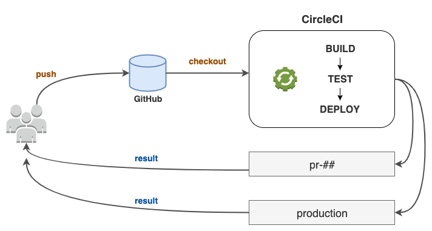
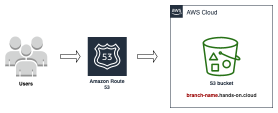
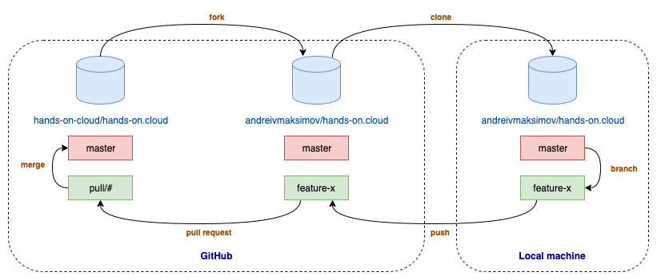
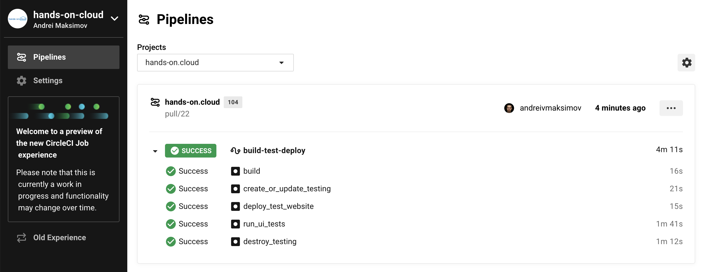

In this article you'll find a set of instructions and builerplate code, which will help you to organize end-to-end CI/CD pipeline for your static website deployment to AWS S3 bucket.

## Technology stack

To demonstrate our solution we'll be using the following technology stack:

* [CircleCI](https://circleci.com/) - Cloud native tool for automating continuous integration and continuous delivery (CI/CD) processes; free for open-source projects
* [Docker](https://www.docker.com/) - Tool, which packages software into standardized units for development, shipment and deployment
* [Cypress](https://www.cypress.io/) - Modern JavaScript end-to-end testing framework; I'm using it to do UI testing
* [GitHub](https://github.com/) - Modern and well-known developers collaboration platform; we're using it to store our code there and collaborating with other developers using pull-requests
* [Terraform](https://www.terraform.io/) - Modern infrastructure management tool, which enables you to safely and predictably create, change, and improve your infrastructure in the cloud or any virtualization platform

## Infrastructure description

Website itself ([this blog](https://github.com/hands-on-cloud/hands-on.cloud/)) is deployed to S3 bucket to AWS cloud and has the following simple architecture.


The goal is to build CI/CD pipeline, which will do the following set of action for every single pull-reguest:

* Create a separate infrastructure in AWS cloud (staging environment) 
* Deploy new version of the blog to staging environment
* Run Web UI tests using [Cypress](https://www.cypress.io/)
* Destroy staging envinronment

We just mentioned staging environment. To speedup infrastructure deployment let's simplify it a little bit and remove CloudFront distribution to minimize deployment part.



We'll be deploying the same environment with the same URL constructed from

* root domain name of our website (`hands-on.cloud`)
* pull-request number

For example, we create new pull request at GitHub and it's number is `22`, than our staging environment will have URL `pr-22.hands-on.cloud`.

As soon as pull-request is merged, we'll be using the same pipeline for deploying our code to production:

* Update production infrastructure, if needed
* Deploy code to production infrastructure

## Developer workflow

Now it's time to describe developer workflow. I highly recommend to use "single branch" or "[trunk based development](https://trunkbaseddevelopment.com/)" strategy to work with your GitHub repository.



Please, pay attention, that we're speaking about strategy of working with Git repository, and not about structuring your code. We'll come back to monorepository question later.

### Initial repository clone

To have an ability to use pull-requests, you need to [fork](https://help.github.com/en/github/getting-started-with-github/fork-a-repo) master repository where all developers in your organization are contributing to and then [clone](https://help.github.com/en/github/creating-cloning-and-archiving-repositories/cloning-a-repository) your forked repository.

```sh
# Clone our repository
git clone git@github.com:andreivmaksimov/hands-on.cloud.git

# Add main repository information to our local copy
cd hands-on.cloud
git remote add main git@github.com:hands-on.cloud/hands-on.cloud.git
```

Now we're ready to work.

### Pull changes from master branch of main repository

```sh
# Switching to local master branch
git checkout master

# Pull master branch changes from main repository  
git pull main master

# Push to our origin master branch
git push origin master
```

### Developing new feature

Let's assume we're developing `feature-x`.

```sh
# Switch to local master branch
git checkout master

# Creating new local branch from the master
git checkout -b feature-x

# Do feature development

# Commiting your changes
git add .
git commit

# Push your changes to your origin repository
# to remote branch with the same name `feature-x`
git push origin feature-x
```

Now, you're going to GitHub and making [pull request from your forked repository](https://help.github.com/en/github/collaborating-with-issues-and-pull-requests/creating-a-pull-request-from-a-fork).

CI/CD pipeline will validate you changes, which could be merged, if all tests passed. That usually not happening from first attempt, so you need to rework your changes a little bit.

### Making changes in your feature branch

We'll be updating only our last commit and update our `feature-x` branch in remote `origin` repository:

```sh
# Assuming, you're in your feature-x branch
git checkout feature-x

# Do you patches\fixes\updates

# Updating you last commit including new changes
git add .
git commit --amend --no-edit

# Updating remote `feature-x` branch in your origin repository
# -f does force update of remote branch and overrides our last commit
git push origin feature-x -f
```

CI/CD pipeline will validate your changes once more again.

Now you can repeat the process till success 😁.

As soon as changes are ready, merge them to main repository and launch automatic update of production infrastructure.

### Synchronizing master branch

It is always important to keep your remote and local `master` branches up-to-date. Here's how we're doing that:

```sh
# Checkout local master branch
git checkout master

# Pull changes from remote master branch of main repository
git pull main master

# Push changes to remote master branch of your forked repository
git push origin master
```

### Rebasing feature branch on the actual master

While you're working on your feature, your colleagues or team mates may push multiple commits to master repository, and it is developer responsibility to synchronize his branch with current master branch before making pull request. To do that run the following commands:

```sh
# Synchronize your local master branch with main remote repository master branch (see above) 

# Chechout your feature branch
git checkout feature-x

# Rebase on the actual master
git rebase master
```

### Deleting your feature branch

As soon as your feature implemented and code been merged to repository and deployed to production, you may delete your feature branch. 

To delete local `feature-x` branch, do

```sh
# Checkout master branch
git checkout master

# Delete feature-x branch
git branch -D feature-x
```

## CI/CD pipeline implementation

We're using [CircleCI](https://circleci.com/) to automate this blog development, testing and deployment operations.

Each time we're making new pull request, we'll be launching the following set of steps:



Steps description:

* `build` - build static Hugo website
* `create_or_update_testing` - launch Terraform to create or update staging environment
* `deploy_test_website` - use `aws-cli` to copy static website to S3 bucket
* `run_ui_tests` - launch Cypress to run UI tests
* `destroy_testing` - destroy staging environment if all previous steps passed; if not environment is not touched for future investigation

As soon as we're accepting pull-request to main repository, our CI/CD pipeline will automatically update production website:


Steps description:

* `build` - build static Hugo website
* `create_or_update_prod` - launch Terraform to create or update production environment
* `deploy_prod_website` - use `aws-cli` to copy static website to production S3 bucket

Here's the full source code of [.circleci/config.yml](https://github.com/hands-on-cloud/hands-on.cloud/blob/9b69cd77ed1064a5057e0e5fdbb0b648ff90a448/.circleci/config.yml), which describes our CICD pipeline.

Below I'll describe this file structure and point your attention to most important places.

### Common configuration blocks

All common CircleCI pipeline configuration blocks determined at `references:` section at the top of the file. For example:

```yml
references:

working_directory: &working_directory
  ~/project
```

### Global environment for CircleCI jobs

The following block setup all necessary variables, which determine environment during CI/CD pipeline execution.

```yml
set_environment: &set_environment
  run:
    name: Set environment
    command: |
      cd && touch $BASH_ENV
      if [ "${CIRCLE_BRANCH}" == "master" ]; then
        echo 'export ENVIRONMENT=default' >> $BASH_ENV
        echo 'export ENVIRONMENT_DOMAIN=hands-on.cloud' >> $BASH_ENV
      else
        echo 'export ENVIRONMENT=staging' >> $BASH_ENV
        ENVIRONMENT_ID="pr-${CIRCLE_PR_NUMBER}"
        echo "export ENVIRONMENT_ID=${ENVIRONMENT_ID}" >> $BASH_ENV
        ENVIRONMENT_DOMAIN="${ENVIRONMENT_ID}.hands-on.cloud"
        echo "export ENVIRONMENT_DOMAIN=${ENVIRONMENT_DOMAIN}" >> $BASH_ENV
      fi
```

We're using `. $BASH_ENV` to import this variables whenever is needed.

### Enviroment variables and context

We're using CircleCI [context](https://circleci.com/docs/2.0/contexts/) to keep all nesessary environment variables and specifying it for every single workflow job:

```yml
workflows:
  version: 2
  build-test-deploy:
    jobs:
      - build:
          context: hands-on-cloud
```

## Monorepository or not monorepository

This is the same question as "[Monolithic vs. Microservices Architecture](https://articles.microservices.com/monolithic-vs-microservices-architecture-5c4848858f59)". As a summary:

* Use single repository for small and simple projects
* Move project components or microservices to a separate repositories as soon as number of components become greater then 3.

## Summary

In this article we've described and tied together technology stack, infrastructure, developer workflow and CI/CD pipeline, which can support development process for your team.

Of cause, even for such simple project, automation may become a really hard task. To avoid significant time investments in the future, we highly recommend to implement very simple CI/CD pipeline from the very beginning of your project.
