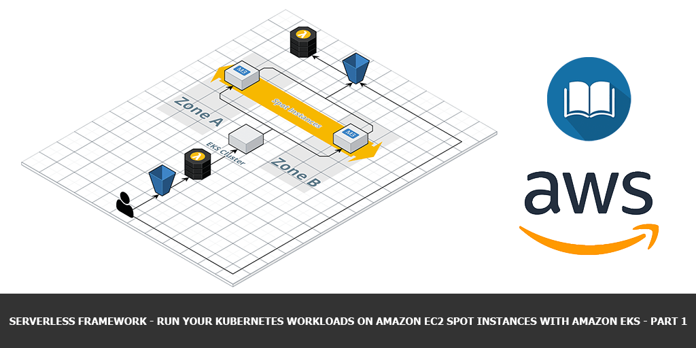

You may be already familiar with [How to use AWS Fargate and Lambda for long-running processes in a Serverless app](https://serverless.com/blog/serverless-application-for-long-running-process-fargate-lambda/) article from official [Serveless blog](https://serverless.com/blog/), where [Rupak Ganguly](https://www.linkedin.com/in/rupakg/) shows us how to offload heavy jobs to ECS cluster. This is very nice, but very [expensive solution](https://blog.csanchez.org/2018/02/06/serverless-ci-cd-with-aws-ecs-fargate/).

Not to far ago AWS team also provided us with very nice technical post about [Running your Kubernetes Workloads on Amazon EC2 Spot Instances with Amazon EKS](https://aws.amazon.com/blogs/compute/run-your-kubernetes-workloads-on-amazon-ec2-spot-instances-with-amazon-eks/).

I like the idea of minimizing the computational costs, so I decided to combine both ideas and show you how to create a simple EKS cluster as a part of our Serverless infrastructure, where your Lambda functions can offload heavy jobs to.

Everything will be done using [Serveless framework](https://serverless.com/). All source code is available in my [GitHub repo](https://github.com/andreivmaksimov/aws-eks-spot-instances-serverless-framework-demo).

Part 2 of this article is available [here](/serverless-framework-run-your-kubernetes-workloads-on-amazon-ec-2-spot-instances-with-amazon-eks-part-2).

## Architecture

We will reproduce Rupak’s idea, but make it working in AWS EKS cluster on top of Spot instances.

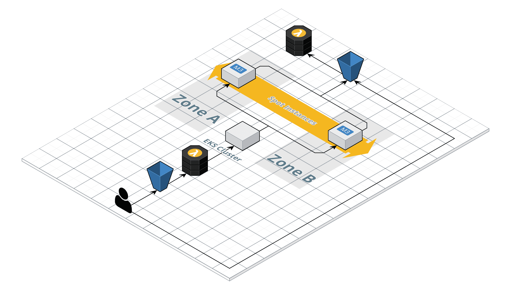

**Workflow description**

- User uploads video file in S3 bucket
- Lambda function triggered and launch Kubernetes Job in EKS cluster
- Job extract thumbnail from the video file and upload it to another S3 bucket
- Next lambda function triggered for future integration (it may send us email, trigger another Kubernetes Job, make some changes in DB, etc).

## Building up infrastructure

Let’s create a new folder and init our project:

```sh
mkdir aws-eks-spot-instances-serverless-framework-demo
cd aws-eks-spot-instances-serverless-framework-demo
sls create -t aws-nodejs -n aws-eks-spot-serverless-demo
```

Also, let’s remove all comments from `serverless.yaml` file and add global `stage:` variable:

```yaml
service: aws-eks-spot-serverless-demo

provider:
  name: aws
  runtime: python3.6
  stage: ${opt:stage, 'dev'}
  region: us-east-1

functions:
  hello:
    handler: handler.hello
```

See [Variables](https://serverless.com/framework/docs/providers/aws/guide/variables/) to get more info about variables declaration in Serverless framework.

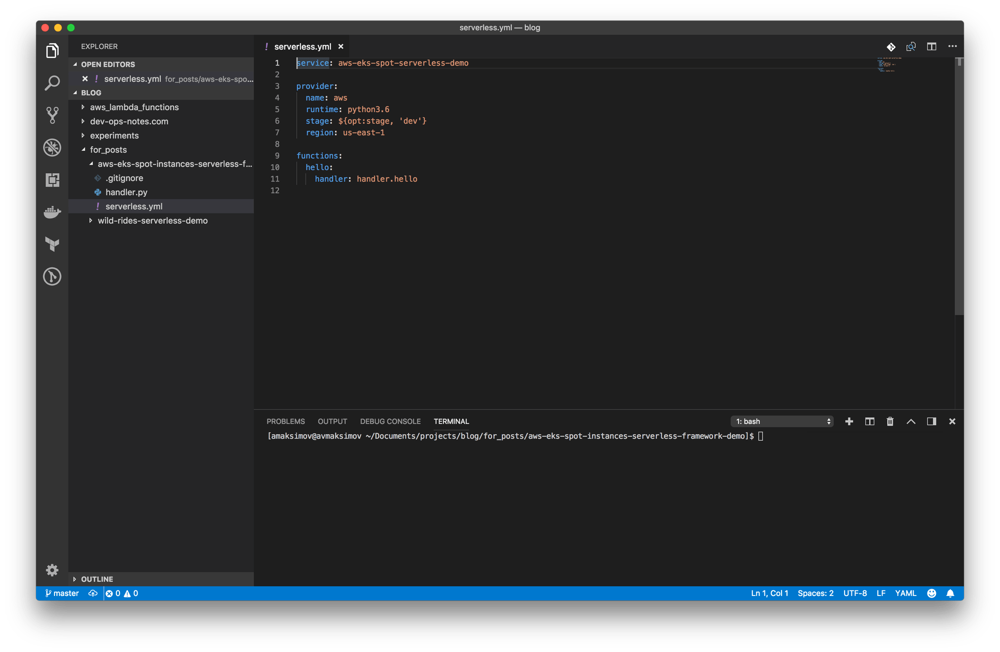

## Upload Lambda function

When we initiated the Serverless project `hello` lambda function definition been created for us automatically. Let’s rename this function and it’s file to something more meaningful and tie the function with just created S3 bucket.

First of all let’s rename `handler.py` file where our Lambda function code is placed to `upload_video.py`:

```sh
mv handler.py upload_video.py
```

Also, it is very useful to change function entry point method name from `hello` to `handler`. So the actual function code will be:

```python
import json

def handler(event, context):
    body = {
        "message": "Go Serverless v1.0! Your function executed successfully!",
        "input": event
    }

    response = {
        "statusCode": 200,
        "body": json.dumps(body)
    }

    return response
```

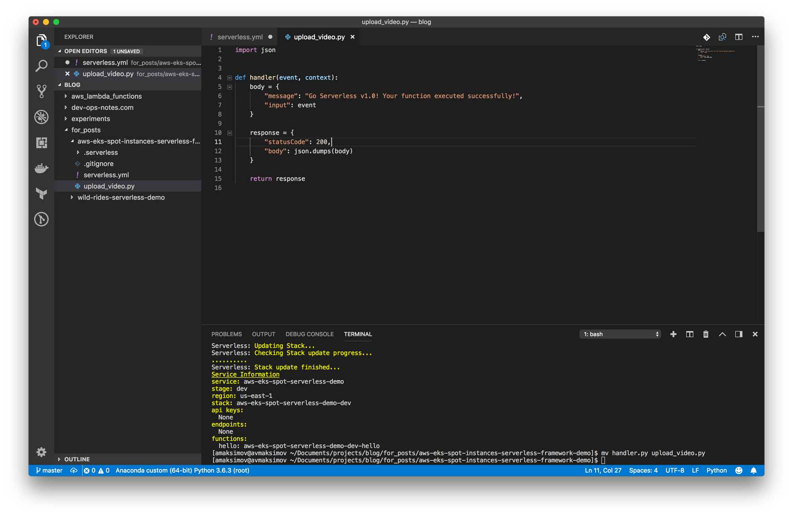

Also, we need to change function `handler:` declaration in `serverless.yaml` file:

```yaml
functions:
  VideoUploadLambdaFunction:
    handler: upload_video.handler
```

Now we need to tell Lambda function, that it should listen for events from S3 bucket. Let’s declare upload bucket and give our Lambda function ability to react on `s3:ObjectCreated` event:

```yaml
functions:
  VideoUploadLambdaFunction:
    handler: upload_video.handler
    events:
      - s3:
          bucket: '${self:service}-${self:provider.stage}-uploads'
    event: s3:ObjectCreated:*
```

You may paid attention on `bucket:` key. It’s value consists of two internal variables `${self:service}` (has the value of our service name – **aws-eks-spot-serverless-demo**) and `${self:provider.stage}` (has the value of the stage name – dev, as a default value). So, the full name of our bucket will be **aws-eks-spot-serverless-demo-dev-uploads**.

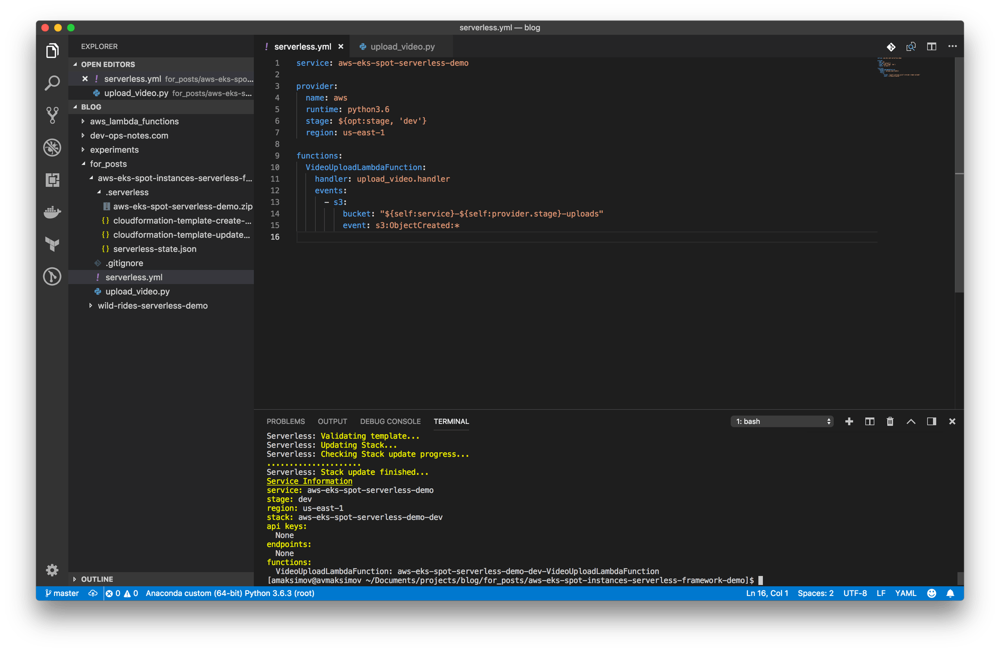

**Reminder**: all S3 buckets must have unique names. So, if you see the message that this bucket is already exists, just change your service name to something unique.

Of cause, there’re multiple options of specifying S3-Lambda events. For more information take a look at the official [Serverless S3 events documentation](https://serverless.com/framework/docs/providers/aws/events/s3).

You may deploy your changes to check if everything’s fine:

```sh
sls deploy
```

## Thumbnais Lambda function

We’ve just created S3 bucket for video uploads and Lambda function, which should react on that events somehow. As you may remember, we also should have another pair of S3 bucket where we want to store video thumbnails and Lambda function which may be used for notifications or further flow control. Let’s create them now:

```yaml
functions:
  VideoThumbnailLambdaFunction:
    handler: upload_thumbnail.handler
    events:
      - s3:
          bucket: '${self:service}-${self:provider.stage}-thumbnails'
          event: s3:ObjectCreated:*
```

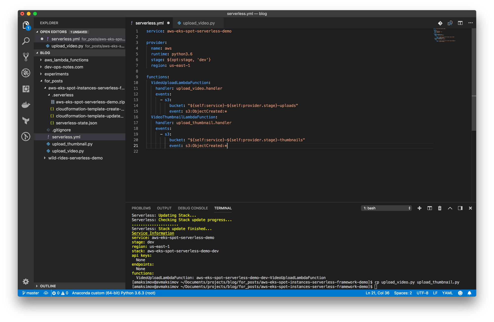

Of cause, also we need to create `upload_thumbnail.py` and declare handler function there. Let’s copy `upload_video.py` content there. We’ll come back to the function implementations later.

```sh
cp upload_video.py upload_thumbnail.py
```

Let’s redeploy our stack to make sure, we did not miss anything:

```sh
sls deploy
```

## EKS cluster setup

Now it’s time to create our EKS AWS managed Kubernetes cluster with spot instances. In this tutorial we’ll create a separate VPC with two public subnets in it for spot instances, so everybody could be on the same page.

### Creating VPC

First of all let’s create a [AWS::EC2::VPC](https://docs.aws.amazon.com/AWSCloudFormation/latest/UserGuide/aws-resource-ec2-vpc.html) resource. In `resources:` section of `serverless.yaml` file we need to write:

```yaml
resources:
  Resources:
    KubernetesClusterVPC:
      Type: AWS::EC2::VPC
      Properties:
        CidrBlock: '10.0.0.0/16'
        EnableDnsSupport: true
        EnableDnsHostnames: true
        Tags:
          - Key: Name
            Value: ${self:service}-${self:provider.stage}
```

Declaring VPC in such way we want Serverless framework to create a VPC with `10.0.0.0/16` address space.


Next, we need to create two subnets by declaring [AWS::EC2::Subnet](https://docs.aws.amazon.com/AWSCloudFormation/latest/UserGuide/aws-resource-ec2-subnet.html) resources:

```yaml
KubernetesClusterSubnetA:
  Type: AWS::EC2::Subnet
  Properties:
    VpcId:
      Ref: KubernetesClusterVPC
    CidrBlock: 10.0.0.0/24
    AvailabilityZone: 'us-east-1a'
    Tags:
      - Key: Name
        Value: ${self:service}-${self:provider.stage}
KubernetesClusterSubnetB:
  Type: AWS::EC2::Subnet
  Properties:
    VpcId:
      Ref: KubernetesClusterVPC
    CidrBlock: 10.0.1.0/24
    AvailabilityZone: 'us-east-1b'
    Tags:
      - Key: Name
        Value: ${self:service}-${self:provider.stage}
```


To allow Internet communication for instances in that subnets we need to create InternetGateway and add specify route `0.0.0.0/0`. Let’s create [AWS::EC2::InternetGateway](https://docs.aws.amazon.com/AWSCloudFormation/latest/UserGuide/aws-resource-ec2-internetgateway.html) resource:

```yaml
KubernetesClusterInternetGateway:
  Type: AWS::EC2::InternetGateway
  Properties:
    Tags:
      - Key: Name
        Value: ${self:service}-${self:provider.stage}
```

To attach InternetGateway to VPC we need to describe [AWS::EC2::VPCGatewayAttachment](https://docs.aws.amazon.com/AWSCloudFormation/latest/UserGuide/aws-resource-ec2-vpc-gateway-attachment.html) resource:

```yaml
KubernetesClusterInternetGatewayAttachment:
  Type: AWS::EC2::VPCGatewayAttachment
  Properties:
    InternetGatewayId:
      Ref: KubernetesClusterInternetGateway
    VpcId:
      Ref: KubernetesClusterVPC
```

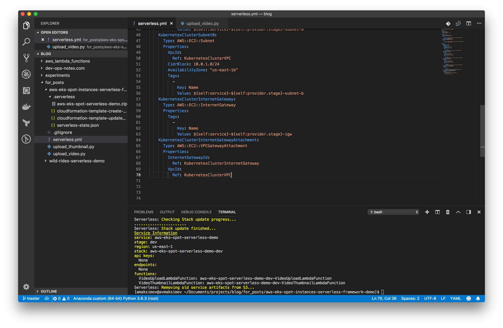

We have VPC, Subnets and InternetGateway, now we need to specify necessary `0.0.0.0/0` route. To do so, we need to create a [AWS::EC2::RouteTable](https://docs.aws.amazon.com/AWSCloudFormation/latest/UserGuide/aws-resource-ec2-route-table.html):

```yaml
KubernetesClusterInternetGatewayRouteTable:
  Type: AWS::EC2::RouteTable
  Properties:
    VpcId:
      Ref: KubernetesClusterVPC
    Tags:
      - Key: Name
        Value: ${self:service}-${self:provider.stage}
```

Create a [AWS::EC2::Route](https://docs.aws.amazon.com/AWSCloudFormation/latest/UserGuide/aws-resource-ec2-route.html) itself:

```yaml
KubernetesClusterInternetGatewayToInternetRoute:
  Type: AWS::EC2::Route
  DependsOn: KubernetesClusterInternetGateway
  Properties:
    RouteTableId:
      Ref: KubernetesClusterInternetGatewayRouteTable
    DestinationCidrBlock: 0.0.0.0/0
    GatewayId:
      Ref: KubernetesClusterInternetGateway
```

And associate our subnets with just created route table by describing two [AWS::EC2::SubnetRouteTableAssociation](https://docs.aws.amazon.com/AWSCloudFormation/latest/UserGuide/aws-resource-ec2-subnet-route-table-assoc.html) resources:

```yaml
KubernetesClusterSubnetAtoInternetRouteAssociation:
  Type: AWS::EC2::SubnetRouteTableAssociation
  Properties:
    RouteTableId:
      Ref: KubernetesClusterInternetGatewayRouteTable
    SubnetId:
      Ref: KubernetesClusterSubnetA
KubernetesClusterSubnetBtoInternetRouteAssociation:
  Type: AWS::EC2::SubnetRouteTableAssociation
  Properties:
    RouteTableId:
      Ref: KubernetesClusterInternetGatewayRouteTable
    SubnetId:
      Ref: KubernetesClusterSubnetB
```


We did a great job! Let’s redeploy our stack to make sure, that everything’s working:

```sh
sls deploy
```

### Creating Kubernetes Master

This is where the AWS EKS service comes into play. It requires a few managed resources beforehand so that Kubernetes can properly manage other AWS services as well as allow inbound networking communication from your local workstation (if desired) and worker nodes.

First of all we need to create an [AWS::IAM::Role](https://docs.aws.amazon.com/AWSCloudFormation/latest/UserGuide/aws-resource-iam-role.html) role for EKS Kubernetes Master:

```yaml
EksKubernetesServiceRole:
  Type: AWS::IAM::Role
  Properties:
    RoleName: EksKubernetesServiceRole
    AssumeRolePolicyDocument:
      Version: '2012-10-17'
      Statement:
        - Effect: Allow
          Principal:
            Service:
              - eks.amazonaws.com
          Action: sts:AssumeRole
    ManagedPolicyArns:
      - 'arn:aws:iam::aws:policy/AmazonEKSClusterPolicy'
      - 'arn:aws:iam::aws:policy/AmazonEKSServicePolicy'
```

Here we’re also attaching pre-defined `AmazonEKSClusterPolicy` and `AmazonEKSServicePolicy` and to our role to allow Kubernetes master manage AWS resources on your behalf.

For the latest required [policy](https://docs.aws.amazon.com/eks/latest/userguide/IAM_policies.html), see the [EKS User Guide](https://docs.aws.amazon.com/eks/latest/userguide/).


Next we need to create [AWS::EC2::SecurityGroup](https://docs.aws.amazon.com/AWSCloudFormation/latest/UserGuide/aws-properties-ec2-security-group.html) to protect Kubernetes Master management port:

```yaml
KubernetesClusterMasterSecurityGroup:
  Type: AWS::EC2::SecurityGroup
  Properties:
    GroupDescription: Allow EKS Cluster communication with worker nodes
    VpcId:
      Ref: KubernetesClusterVPC
    SecurityGroupEgress:
      - IpProtocol: -1
        FromPort: 0
        ToPort: 0
        CidrIp: 0.0.0.0/0
    Tags:
      - Key: Name
        Value: ${self:service}-${self:provider.stage}
```

We will later configure this group with an ingress rule to allow traffic from the worker nodes. But now you may want to enable management connection form your workstation. To do that, you need to create [AWS::EC2::SecurityGroupIngress](https://docs.aws.amazon.com/AWSCloudFormation/latest/UserGuide/aws-properties-ec2-security-group-ingress.html) resource and attach it to just created `SecurityGroup`:

```yaml
# OPTIONAL: Allow inbound traffic from your local workstation external IP
#           to the Kubernetes. You will need to replace A.B.C.D below with
#           your real IP. Services like icanhazip.com can help you find this.
KubernetesClusterMasterFromWorkstationSecurityGroupRule:
  Type: AWS::EC2::SecurityGroupIngress
  Properties:
    CidrIp: A.B.C.D/32
    # CidrIp: 138.68.101.60/32
    Description: Allow workstation to communicate with the EKS cluster API Server
    FromPort: 443
    IpProtocol: tcp
    ToPort: 443
    GroupId:
      Ref: KubernetesClusterMasterSecurityGroup
```

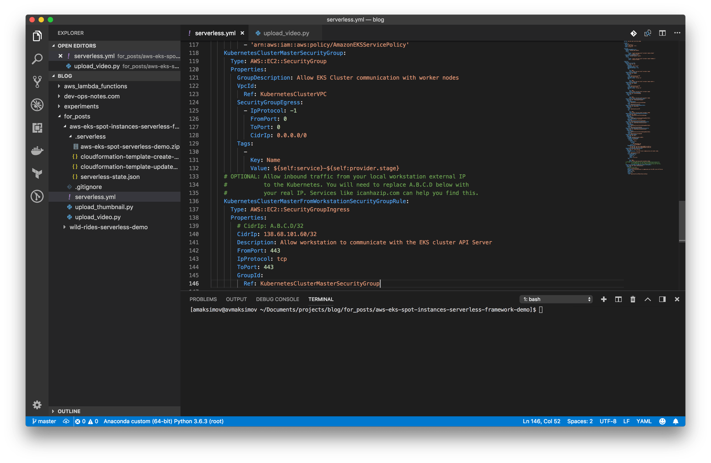

Now we can declare [AWS::EKS::Cluster](https://docs.aws.amazon.com/AWSCloudFormation/latest/UserGuide/aws-resource-eks-cluster.html) to create Kubernetes cluster itself:

```yaml
KubernetesCluster:
  Type: 'AWS::EKS::Cluster'
  Properties:
    Name: ${self:service}-${self:provider.stage}
    ResourcesVpcConfig:
      SecurityGroupIds:
        - Ref: KubernetesClusterMasterSecurityGroup
      SubnetIds:
        - Ref: KubernetesClusterSubnetA
        - Ref: KubernetesClusterSubnetB
    RoleArn:
      Fn::GetAtt: [EksKubernetesServiceRole, Arn]
    Version: '1.10'
```

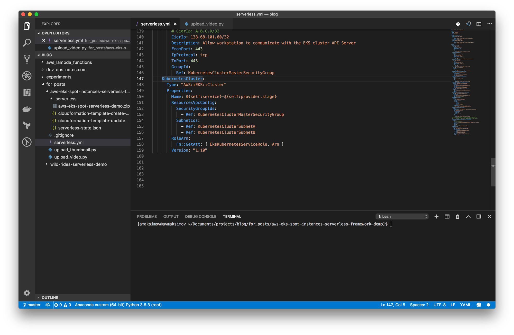

Finally, we want to get some cluster parameters to create connection configuration file. Let’s declare them in the `Outputs:` section of the `resources:` declaration in `serverless.yaml` file:

```yaml
Outputs:
  KubernetesClusterName:
    Description: 'EKS Cluster Name'
    Value:
      Ref: KubernetesCluster
  KubernetesClusterEndpoint:
    Description: 'EKS Cluster Endpoint'
    Value:
      Fn::GetAtt: [KubernetesCluster, Endpoint]
  KubernetesClusterCertificateAuthorityData:
    Description: 'EKS Cluster Certificate Authority Data'
    Value:
      Fn::GetAtt: [KubernetesCluster, CertificateAuthorityData]
```

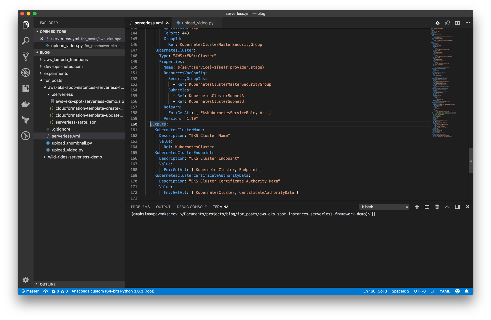

Now we’re ready to deploy Kubernetes cluster as a part of our Serverless stack:

```sh
sls deploy
```

As soon as Kubernetes cluster deployment finishes, we need to create `~/.kube/config` file, with the following command (please, **use the latest** [awscli](https://aws.amazon.com/cli/)):

```sh
aws eks update-kubeconfig --name $(sls info --verbose | grep 'stack:' | awk '{split($0,a," "); print a[2]}')
```

### Kubectl installation

Install `kubectl` and `aws-iam-authenticator` as described in official AWS article [Configure kubectl for Amazon EKS](https://docs.aws.amazon.com/eks/latest/userguide/configure-kubectl.html).

Now we may test connection to Kubernetes cluster:

```sh
kubectl get svc
```

### Connecting Spot instances to the cluster

First of all we need to create a [AWS::IAM::Role](https://docs.aws.amazon.com/AWSCloudFormation/latest/UserGuide/aws-resource-iam-role.html) where all necessary permissions would be specified:

```yaml
NodeInstanceRole:
  Type: AWS::IAM::Role
  Properties:
    AssumeRolePolicyDocument:
      Version: '2012-10-17'
      Statement:
        - Effect: Allow
          Principal:
            Service:
              - ec2.amazonaws.com
          Action: sts:AssumeRole
    Path: '/'
    Policies:
      - PolicyName: node
        PolicyDocument:
          Version: '2012-10-17'
          Statement:
            - Effect: Allow
              Action:
                - ec2:Describe*
                - ecr:GetAuthorizationToken
                - ecr:BatchCheckLayerAvailability
                - ecr:GetDownloadUrlForLayer
                - ecr:GetRepositoryPolicy
                - ecr:DescribeRepositories
                - ecr:ListImages
                - ecr:BatchGetImage
              Resource: '*'
      - PolicyName: cni
        PolicyDocument:
          Version: '2012-10-17'
          Statement:
            - Effect: Allow
              Action:
                - ec2:DescribeNetworkInterfaces
                - ec2:DescribeInstances
                - ec2:CreateNetworkInterface
                - ec2:AttachNetworkInterface
                - ec2:DeleteNetworkInterface
                - ec2:DetachNetworkInterface
                - ec2:ModifyNetworkInterfaceAttribute
                - ec2:AssignPrivateIpAddresses
                - tag:TagResources
              Resource: '*'
      - PolicyName: eks
        PolicyDocument:
          Version: '2012-10-17'
          Statement:
            - Effect: Allow
              Action:
                - eks:DescribeCluster
              Resource: '*'
      - PolicyName: s3-management
        PolicyDocument:
          Version: '2012-10-17'
          Statement:
            - Effect: Allow
              Action:
                - s3:PutObject
                - s3:GetObject
                - s3:ListBucket
                - s3:DeleteObject
              Resource:
                - Fn::GetAtt: [S3BucketAwseksspotserverlessdemodevuploads, Arn]
                - Fn::Join:
                    - '/'
                    - - Fn::GetAtt:
                          [S3BucketAwseksspotserverlessdemodevuploads, Arn]
                      - '*'
            - Effect: Allow
              Action:
                - s3:PutObject
                - s3:GetObject
                - s3:ListBucket
                - s3:DeleteObject
              Resource:
                - Fn::GetAtt:
                    [S3BucketAwseksspotserverlessdemodevthumbnails, Arn]
                - Fn::Join:
                    - '/'
                    - - Fn::GetAtt:
                          [S3BucketAwseksspotserverlessdemodevthumbnails, Arn]
                      - '*'
            - Effect: Allow
              Action:
                - s3:HeadBucket
              Resource: '*'
      - PolicyName: ClusterAutoscaler
        PolicyDocument:
          Version: '2012-10-17'
          Statement:
            - Effect: Allow
              Action:
                - ec2:DescribeRegions
                - ec2:DescribeInstances
              Resource: '*'
            - Effect: Allow
              Action:
                - ecr:GetAuthorizationToken
                - ecr:BatchCheckLayerAvailability
                - ecr:GetDownloadUrlForLayer
                - ecr:GetRepositoryPolicy
                - ecr:DescribeRepositories
                - ecr:ListImages
                - ecr:BatchGetImage
              Resource: '*'
            - Effect: Allow
              Action:
                - autoscaling:DescribeAutoScalingGroups
                - autoscaling:DescribeAutoScalingInstances
                - autoscaling:DescribeLaunchConfigurations
                - autoscaling:SetDesiredCapacity
                - autoscaling:DescribeTags
                - autoscaling:TerminateInstanceInAutoScalingGroup
              Resource: '*'
```

Policy `s3-management` specified access permissions to our S3 buckets. All the others are needed for EKS Nodes by default.

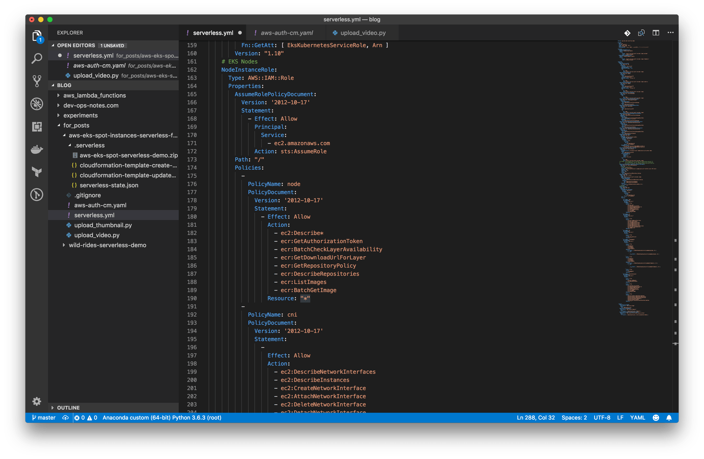

To allow EKS Nodes authentication on EKS Master we need to install AWS IAM Authenticator configuration map to EKS cluster. To get Node role ARN we need to add the following to the Outputs: section of resources: declaration:

```yaml
KubernetesClusterNodesRoleArn:
  Description: 'EKS Cluster Nodes Role Arn'
  Value:
    Fn::GetAtt: [NodeInstanceRole, Arn]
```

Now you may redeploy the stack and get it:

```sh
sls deploy
sls info --verbose
```

As described at [Launching Amazon EKS Worker Nodes](https://docs.aws.amazon.com/eks/latest/userguide/launch-workers.html) page of the official AWS EKS User Guide, let’s download the config map:

```sh
curl -O https://amazon-eks.s3-us-west-2.amazonaws.com/cloudformation/2018-08-30/aws-auth-cm.yaml
```

Replace in the file to the `KubernetesClusterNodesRoleArn` output of `sls info --verbose`:

```yaml
apiVersion: v1
kind: ConfigMap
metadata:
  name: aws-auth
  namespace: kube-system
data:
  mapRoles: |
    - rolearn: 
      username: system:node:
      groups:
        - system:bootstrappers
        - system:nodes
```

Deploy this config map to EKS Master as it is done usually in Kubernetes and remove the file, we’ll not need it anymore:

```sh
kubectl apply -f aws-auth-cm.yaml
rm aws-auth-cm.yaml
```

Now, we need to describe [AWS::IAM::InstanceProfile](https://docs.aws.amazon.com/AWSCloudFormation/latest/UserGuide/aws-resource-iam-instanceprofile.html) to provide EKS Nodes with appropriate permissions:

```yaml
NodeInstanceProfile:
  Type: AWS::IAM::InstanceProfile
  Properties:
    Path: '/'
    Roles:
      - Ref: NodeInstanceRole
```


Next thing to do is to declare [AWS::EC2::SecurityGroup](https://docs.aws.amazon.com/AWSCloudFormation/latest/UserGuide/aws-properties-ec2-security-group.html) and allow network communication between Nodes, Nodes and Master and from our workstation to Nodes if needed. SecurityGroup for Nodes:

```yaml
NodeSecurityGroup:
  Type: AWS::EC2::SecurityGroup
  Properties:
    GroupDescription: Security group for all nodes in the EKS cluster
    VpcId:
      Ref: KubernetesClusterVPC
    Tags:
      - Key: Name
        Value: ${self:service}-${self:provider.stage}
```

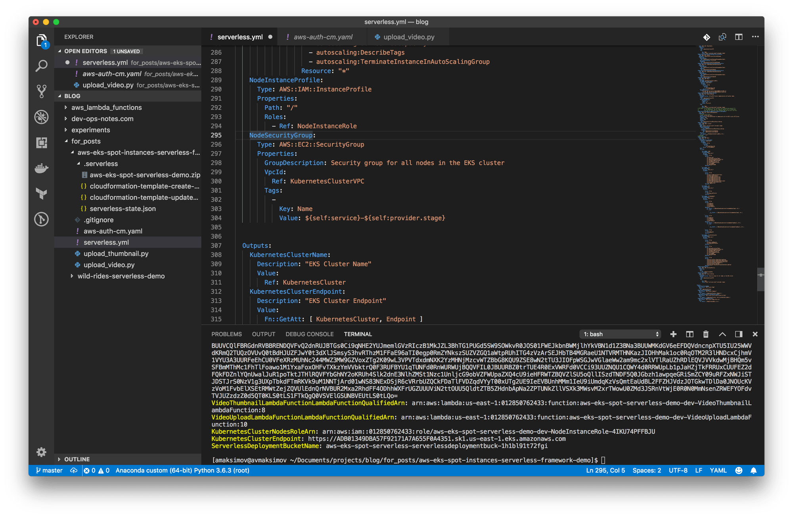

Here’s [AWS::EC2::SecurityGroupIngress](https://docs.aws.amazon.com/AWSCloudFormation/latest/UserGuide/aws-properties-ec2-security-group-ingress.html) rules which are allowing network traffic:

```yaml
NodeSecurityGroupIngress:
  Type: AWS::EC2::SecurityGroupIngress
  Properties:
    Description: Allow node to communicate with each other
    GroupId:
      Ref: NodeSecurityGroup
    SourceSecurityGroupId:
      Ref: NodeSecurityGroup
    IpProtocol: '-1'
    FromPort: 0
    ToPort: 65535
# Replace A.B.C.D with your workstation IP address
NodeSecurityGroupFromWorkstationIngress:
  Type: AWS::EC2::SecurityGroupIngress
  Properties:
    Description: Allow workstation to connect to EC2 nodes (for debugging)
    GroupId:
      Ref: NodeSecurityGroup
    IpProtocol: 'tcp'
    FromPort: 22
    ToPort: 22
    CidrIp: A.B.C.D/32
NodeSecurityGroupFromControlPlaneIngress:
  Type: AWS::EC2::SecurityGroupIngress
  Properties:
    Description: Allow worker Kubelets and pods to receive communication from the cluster control plane
    GroupId:
      Ref: NodeSecurityGroup
    SourceSecurityGroupId:
      Ref: KubernetesClusterMasterSecurityGroup
    IpProtocol: tcp
    FromPort: 1025
    ToPort: 65535
KubernetesClusterMasterSecurityGroupIngressFromNodes:
  Type: AWS::EC2::SecurityGroupIngress
  Properties:
    Description: Allow pods to communicate with the cluster API Server
    GroupId:
      Ref: KubernetesClusterMasterSecurityGroup
    SourceSecurityGroupId:
      Ref: NodeSecurityGroup
    IpProtocol: tcp
    ToPort: 443
    FromPort: 443
```

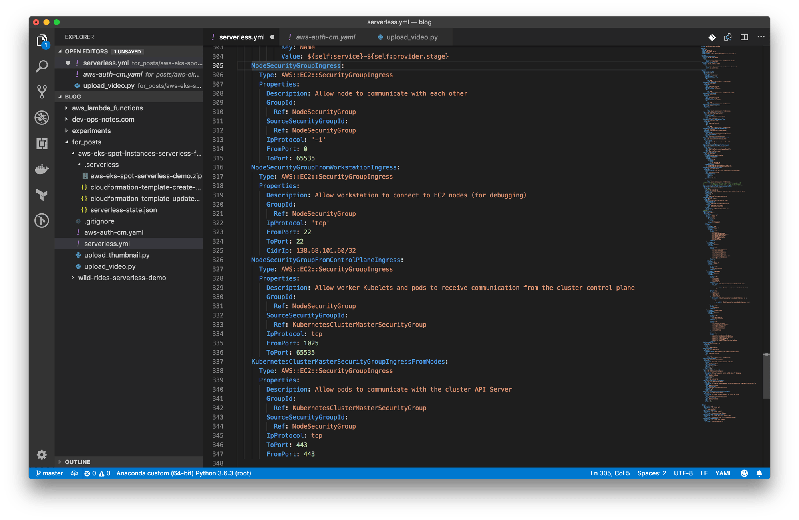

Next we need to create [AWS::AutoScaling::LaunchConfiguration](https://docs.aws.amazon.com/AWSCloudFormation/latest/UserGuide/aws-properties-as-launchconfig.html) for our Spot instances:

```yaml
SpotNodeLaunchConfig:
  Type: AWS::AutoScaling::LaunchConfiguration
  Properties:
    AssociatePublicIpAddress: true
    # https://docs.aws.amazon.com/eks/latest/userguide/eks-optimized-ami.html
    ImageId: ami-0440e4f6b9713faf6
    InstanceType: m3.medium
    IamInstanceProfile:
      Ref: NodeInstanceProfile
    KeyName: 'Lenovo T410'
    # Maximum Spot instance price (not launch if more)
    SpotPrice: 1
    SecurityGroups:
      - Ref: NodeSecurityGroup
    UserData:
      Fn::Base64:
        Fn::Join:
          - ''
          - - "#!/bin/bash -xe\n"
            - 'CA_CERTIFICATE_DIRECTORY=/etc/kubernetes/pki'
            - "\n"
            - 'CA_CERTIFICATE_FILE_PATH=$CA_CERTIFICATE_DIRECTORY/ca.crt'
            - "\n"
            - 'MODEL_DIRECTORY_PATH=~/.aws/eks'
            - "\n"
            - 'MODEL_FILE_PATH=$MODEL_DIRECTORY_PATH/eks-2017-11-01.normal.json'
            - "\n"
            - 'mkdir -p $CA_CERTIFICATE_DIRECTORY'
            - "\n"
            - 'mkdir -p $MODEL_DIRECTORY_PATH'
            - "\n"
            - Fn::Join:
                - ''
                - - 'aws eks describe-cluster --region=${self:provider.region} --name='
                  - Ref: KubernetesCluster
                  - " --query 'cluster.{certificateAuthorityData: certificateAuthority.data, endpoint: endpoint}' > /tmp/describe_cluster_result.json"
            - "\n"
            - 'cat /tmp/describe_cluster_result.json | grep certificateAuthorityData | awk ''{print $2}'' | sed ''s/[,"]//g'' | base64 -d >  $CA_CERTIFICATE_FILE_PATH'
            - "\n"
            - 'MASTER_ENDPOINT=$(cat /tmp/describe_cluster_result.json | grep endpoint | awk ''{print $2}'' | sed ''s/[,"]//g'')'
            - "\n"
            - 'INTERNAL_IP=$(curl -s http://169.254.169.254/latest/meta-data/local-ipv4)'
            - "\n"
            - 'sed -i s,MASTER_ENDPOINT,$MASTER_ENDPOINT,g /var/lib/kubelet/kubeconfig'
            - "\n"
            - Fn::Join:
                - ''
                - - 'sed -i s,CLUSTER_NAME,'
                  - Ref: KubernetesCluster
                  - ',g /var/lib/kubelet/kubeconfig'
            - "\n"
            - 'sed -i s,REGION,${AWS::Region},g /etc/systemd/system/kubelet.service'
            - "\n"
            - "sed -i s,MAX_PODS,'12 --node-labels lifecycle=Ec2Spot',g /etc/systemd/system/kubelet.service"
            - "\n"
            - 'sed -i s,INTERNAL_IP,$INTERNAL_IP,g /etc/systemd/system/kubelet.service'
            - "\n"
            - 'DNS_CLUSTER_IP=10.100.0.10'
            - "\n"
            - 'if [[ $INTERNAL_IP == 10.* ]] ; then DNS_CLUSTER_IP=172.20.0.10; fi'
            - "\n"
            - 'sed -i s,DNS_CLUSTER_IP,$DNS_CLUSTER_IP,g  /etc/systemd/system/kubelet.service'
            - "\n"
            - 'sed -i s,CERTIFICATE_AUTHORITY_FILE,$CA_CERTIFICATE_FILE_PATH,g /var/lib/kubelet/kubeconfig'
            - "\n"
            - 'sed -i s,CLIENT_CA_FILE,$CA_CERTIFICATE_FILE_PATH,g  /etc/systemd/system/kubelet.service'
            - "\n"
            - 'systemctl daemon-reload'
            - "\n"
            - 'systemctl restart kubelet'
            - "\n"
            - '/opt/aws/bin/cfn-signal -e $? '
            - '         --stack ${self:service}-${self:provider.region} '
            - '         --resource NodeGroup '
            - '         --region ${self:provider.region}'
```

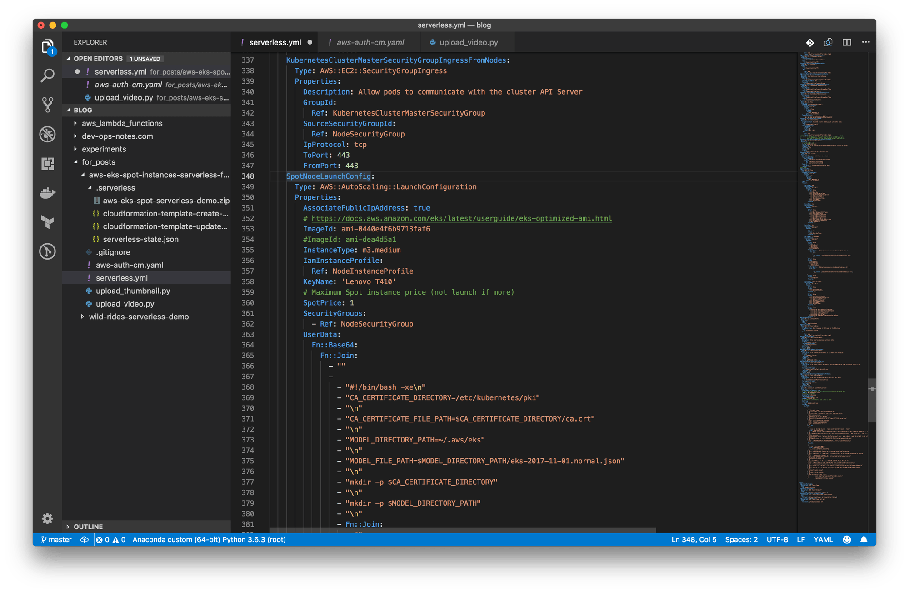

And finally we need [AWS::AutoScaling::AutoScalingGroup](https://docs.aws.amazon.com/AWSCloudFormation/latest/UserGuide/aws-properties-as-group.html):

```yaml
SpotNodeGroup:
  Type: AWS::AutoScaling::AutoScalingGroup
  Properties:
    DesiredCapacity: 1
    LaunchConfigurationName:
      Ref: SpotNodeLaunchConfig
    # To allow rolling updates
    MinSize: 0
    MaxSize: 2
    VPCZoneIdentifier:
      - Ref: KubernetesClusterSubnetA
      - Ref: KubernetesClusterSubnetB
    Tags:
      - Key: Name
        Value: ${self:service}-${self:provider.stage}
        PropagateAtLaunch: true
      - Key:
          Fn::Join:
            - '/'
            - - 'kubernetes.io'
              - 'cluster'
              - '${self:service}-${self:provider.stage}'
        Value: 'owned'
        PropagateAtLaunch: 'true'
  UpdatePolicy:
    AutoScalingRollingUpdate:
      MinInstancesInService: 0
      MaxBatchSize: 1
```


Now all we need to do is to redeploy the stack and see how our instances are joining to the cluster:

```sh
sls deploy
kubectl get nodes --watch
```

## Cleaning up

To cleanup everything all you need to do is to run the following command to destroy the infrastructure:

```sh
sls remove
```

## Final words

OK, I guess it’s enough for the first part. You did a great job!

From this article you’ve learned how to add AWS EKS Cluster with Spot Instances to your environment, built on top of Serverless framework.

For those of you, who want to know, how to create several AutoScaling Groups with different instance types, I highly recommend original [Run your Kubernetes Workloads on Amazon EC2 Spot Instances with Amazon EKS](https://aws.amazon.com/blogs/compute/run-your-kubernetes-workloads-on-amazon-ec2-spot-instances-with-amazon-eks/) article and [CloudFormation template](https://github.com/awslabs/ec2-spot-labs/blob/master/ec2-spot-eks-solution/provision-worker-nodes/amazon-eks-nodegroup-with-spot.yaml) from [awslabs GitHub repo](https://github.com/awslabs).

In the next article I’ll show you [how to launch Kubernetes Jobs from AWS Lambda](/serverless-framework-run-your-kubernetes-workloads-on-amazon-ec-2-spot-instances-with-amazon-eks-part-2) function to offload heavy Serverless infrastructure jobs.

Stay tuned!
